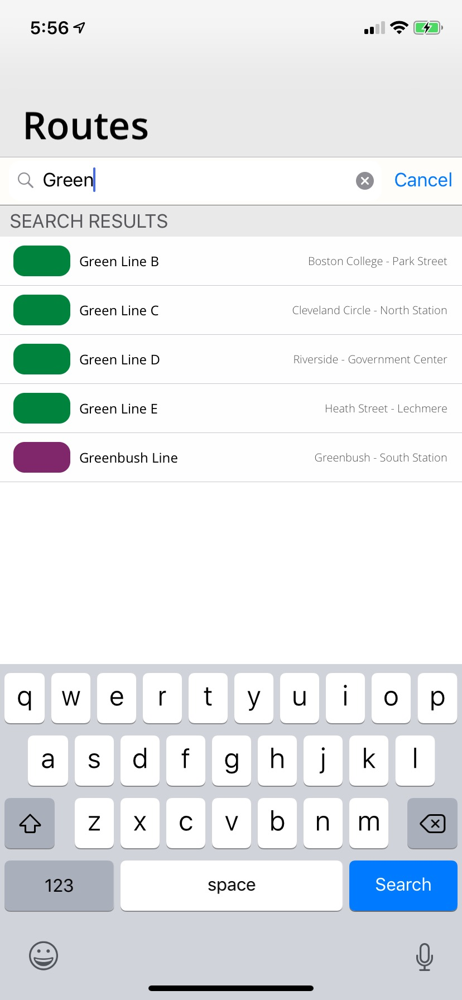

# MyMBTA : MBTA-Application for iOS

This is a work in progress. Since this project is still in developmental stage, any images or fonts used <b> currently </b> in this project will not be included in the final project since some are retrieved from Google and they are not of my creation. This is an unpublished project, therefore, there are no economical gains whatsoever from the production of this. The logo for this application is NOT the logo that will be used upon release, this is simply used as a prototype to provide more aesthetic to the production stage.

I have made all of my sources free for the public. Anybody can view this, and anybody can use any source of code contained in this GitHub project free of will. No crediting is needed but it will be much appreciated :)

# What exactly is MyMBTA?

This MBTA Application, with a draft mock-up name of "MyMBTA" is an iOS application coded by Jorge Jimenez using the latest version of XCode. The final work is expected to be an application which is expected to be used by the citizens of Boston as their most reliant source when using any of the services provided by the Massachusetts Bay Transportation Authority. This application is not related or endorsed by the Massachusetts Bay Transportation Authority.

In the demo stage, no auto-layout is implemented for any iPhone other than the iPhone X. Therefore, any rendering and previewing will be previewed for now using iPhone X as the base size of the canvas. In other words, this will not run to size in an iPhone 7.

# How does it work and what features are currently implemented?

MyMBTA makes use of the <a href = "https://www.mbta.com/developers/v3-api"> MBTA V3 API </a> and uses <a href = "https://github.com/Alamofire/Alamofire"> Alamofire </a> to call the MBTA V3 API to make calls to the API to retrieve live or constant data provided by the Massachusetts Bay Transportation Authority. The application has a one time (only appears on installment) user friendly introduction to the application, which shows the users what to expect. This one-time feature is not up to date at the moment and does not provide the correct information since the project is up to development, but the complete framework is already implemented to the project.

Furthermore, the project also makes use of <b> CoreData </b> by making an initial call to the API and storing all the names and important information of every route (not including stops and other information) locally on the application. This is done on download and it saves time, because everytime a user enters the application it does not have to reconnect to the internet and make a tedious call which takes time to load. The application uses <a href = "https://github.com/SwiftyJSON/SwiftyJSON"> SwiftyJSON </a> to parse any JSON returned by the API. At the moment, users are able to look at all the routes, which include:
<ul>
  <li> Light Rail </li>
  <li> Heavy Rail </li>
  <li> Commuter Rail </li>
  <li> Buses </li>
  <li> Ferry </li>
</ul>

The application also uses <b> CoreData </b> and <b> NSFetchRequest </b> to allow the user to search specific routes. Currently, routes can be searched by name or type of route (i.e Green Line B or Commuter Rail). In future stages, the search bar is expected to work by inserting key words, stops, location name and even lat/long coordinates.

If a user is interested in a specific stop, he is allowed to click on the stop, producing an additional call to the API which retrieves information on every stop. The stops are displayed for the users to see, and users can filter between a Northbound or Southbound display. Framework for direction and more information on a stop is added, however, these are not currently implemented in the application therefore clicking the button does not work.

For user convenience but simultaneously memory enhancement, this feature <b> currently </b> works in a cache system. Every time a user makes a call to display information on a route, the application saves a copy of the most recent stop displayed. This mean if a user returns or exits the apps, and clicks on the same route, it can display the information in lightning speed without having to do an additional call to the API. However, another route will have to produce another call, and may take some time depending on the Internet of the user, and the current algorithm is a trivial approach which means it has a lot of room for enhancement in the future to come.

Other Cocoapods used by the application include <a href = "https://github.com/viccalexander/Chameleon"> ChameleonFramework </a>, <a> ChameleonFramework </a>, <a href = "https://github.com/SVProgressHUD/SVProgressHUD"> SVProgressHUD </a> and <a href = "https://cocoapods.org/pods/TableViewReloadAnimation"> TableViewReloadAnimation </a>.

# What are some features expected to be implemented in this application.

Currently, somewhere in my mind I have jotted down in my head the following head. This application will certainly include but it is not limited to:

<ul>
  <li> Real-time updates on service issues and track information </li>
  <li> Location services and predictions: find the location of any stop on the map, find your distance to and from the stop, view where the train currently is, precise predictions on when a certain train is expected to be at a certain stop, nearby stop filtering depending on your location and more.   </li>
  <li> Home Page: Have a user-friendly home page which filters news or important information relating to the MBTA or even Massachusetts in general. </li>
  <li> Favorites: Have a favorite options which allows user to filter favorite routes and stops and be able to retrieve information of them at better ease. This is basically the most essential feature because in here is where the user will store the routes and stops they use day by day. This feature may even include a "Create Custom Route" option for uses who use multiple services in a single day. </li>
</ul>

Again, these are simple some of many ideas that will be included in the final project. If there are any ideas which you would like to share with me or if you would want to collaborate in this project, feel free to email me at jorjimen@bu.edu.

You can also find me on <a href = "https://www.linkedin.com/in/jorge-jimenez-315801186/">  LinkedIn</a>.
